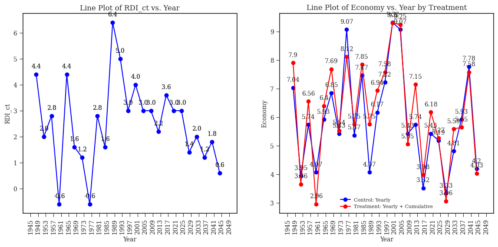
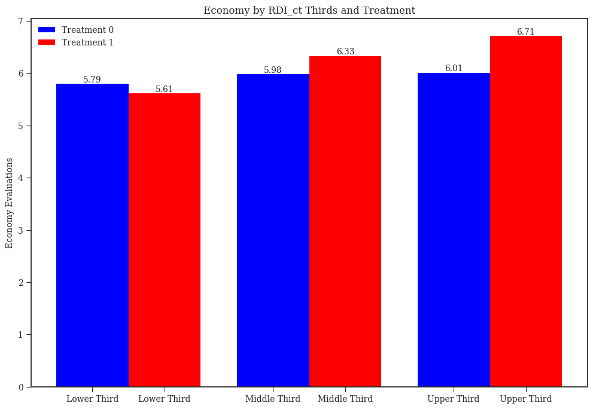
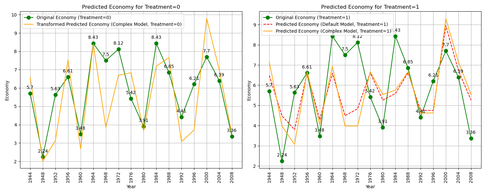
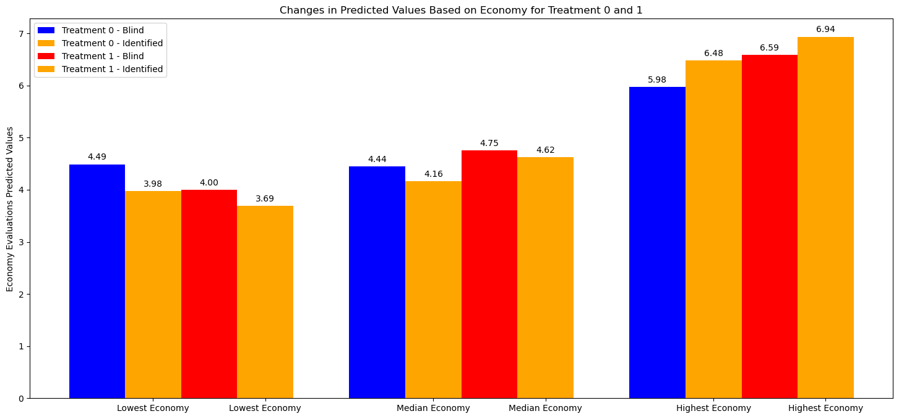

```{r setup, include=FALSE}
library(dplyr)
library(ggplot2)
library(httr)
library(knitr)
library(rmarkdown)
library(tinytex)
knitr::opts_chunk$set(echo = FALSE,
                      message = F,
                      warning = F)
```

\newpage
\doublespacing
## Abstract

This research explores how affective judgments—emotional ties and sentiments towards political leaders—influence citizens' economic evaluations of identified incumbents, particularly in retrospective voting. Affective judgments can shape perceptions of political leaders, influencing performance evaluations by associating leaders with good or bad times, regardless of their direct responsibility. Retrospective voting often involves assessing incumbents' past economic performance. However, the end bias—voters' overemphasis on the last year of economic growth relative to the previous three in a presidential term—can distort their judgments. Previous work by @HealyLenz_2014 addressed the end bias by emphasizing access to "right" information through yearly and cumulative framing. However, this research challenges these conclusions, moving beyond hypothetical scenarios to examine real economic data and the interplay of affect and cognitive biases. Our central question is whether framing—the selection and presentation of—economic information with both yearly and cumulative levels can mitigate the influence of affective judgments, facilitating a more balanced and informed assessment of incumbents' economic performance. Through a survey experiment, we employ a sentiment thermometer to measure participants' affective responses to presidents and how framing conditions may lead to unintentional emphasis on election-year economic growth rather than evaluating leaders evenly throughout their terms.

## Introduction

Retrospective voting, the process of assessing incumbents' past performance, is particularly susceptible to the influence of biases, unrelated events, and framing [@huhilenz_2012]. Conventional defenses of democratic accountability rely on the theory of retrospective voting to suggest that citizens would behave rationally based on recollections of incumbents’ past performance, even in the presence of limited information [@key_1966; @fiorina_1981]. However, based on @kramer_1971, @fair_1978, and @tufte_1978, research by @achenbartels_2004 challenge this notion, arguing that voters often make retrospective voting decisions based on how they feel about recent conditions and their susceptibility to manipulation by governments.

The evaluation of presidential performance plays a controversial role in retrospective voting especially due to the inherent limitations of human information-processing capacity [@simon_1957] and the widespread use of cognitive heuristics or mental shortcuts [@redlau_1997; @kahn_2011]. Affective judgments, or emotional ties and sentiments towards political leaders, have been shown to shape perceptions of political figures, influencing performance evaluations by associating leaders with good or bad times, regardless of their direct responsibility [@taberlodge_2013; @CampelloZucco_CommodityPrices2022]. In the context of economic performance evaluations, the end bias, or the emphasis on election-year economic conditions, can lead voters to overweigh the last year of economic growth relative to the previous three in a presidential term [@HealyLenz_2014]. These findings suggest that affective judgments can play a significant role in influencing retrospective voting decisions, leading to potentially unfair and inaccurate economic performance evaluations of incumbents.

Previous research by @HealyLenz_2014, examined the role of framing, or the selection and presentation of information, in mitigating the end bias, a tendency for voters to weigh recent economic conditions more heavily when evaluating incumbents. Their findings suggest that framing economic information with both yearly and cumulative levels can reduce the end bias, indicating that framing can help voters make more balanced and informed retrospective assessments. However, this research used hypothetical economic data and has not specifically addressed the influence of affective judgments on retrospective voting.

In addition to framing economic information, it is crucial to understand the influence of affective judgments in evaluating identified incumbents. @CampelloZucco_CommodityPrices2022 emphasize the issue of misattribution of responsibility, which occurs when voters attribute economic conditions to incumbents even when those conditions are determined by factors beyond governmental control. They show that misattribution is not solely a matter of access to information, but rather that voters often struggle to accurately apply available information. They find that individuals’ prior affective ties to political leaders cloud their willingness and capacity to discount exogenous conditions and therefore to update their judgments of political figures.

Moreover, @CampelloZucco_CommodityPrices2022 find that individuals are more likely to use information to discount exogenous conditions and update their judgments, particularly in the case of a hypothetical rather than an identified incumbent. However, their findings imply that updates are even less likely when information is provided only one time as in their experimental setting, which reinforces the pessimistic perspective of @huhilenz_2012 on the effectiveness of information provision in modifying individual behavior. These arguments contrast with @taberlodge_2013, who suggest that people automatically update their attitudes toward a variety of social and political objects at the time they encounter relevant information.

Affective ties pose a barrier to the objective evaluation of available information and the updating of judgments especially when they clash with affect for political figures [@CampelloZucco_CommodityPrices2022]. However, the magnitude of exogenous factors varies significantly among regions, generating positive or negative affective judgments that may be more difficult to reverse in some countries compared to others. Notably, @HealyLenz_2014 study focuses on the USA while @CampelloZucco_CommodityPrices2022 research is based in Brazil, where external factors might exert a stronger influence on affective judgments.

@camzuvol_2020 claim that exposure to exogenous shocks, strongly associated with dependence on commodities and variations in trade, is a fundamental structural difference between developed and developing economies. They argue that countries highly exposed to volatile exogenous conditions face more challenges in identifying the competence of governments based on the economy. Finally, they suggest that misattribution appears not to be just a problem of information provision but rather a cognitive issue, and that the processing of relevant information could allow for a better attribution of responsibility for the economy in developed countries than in developing ones.

The present research aims to build on these findings by investigating whether framing economic information with both yearly and cumulative levels can mitigate the influence of affective judgments, facilitating a more balanced and informed assessment of incumbents' economic performance. As @taberlodge_2013 argue, affective judgments are activated faster than any other consideration, and often operate unconsciously. This means that voters may have already formed affective judgments about an incumbent's economic performance based on recollections of particularly good or bad economic conditions, without fully considering the incumbent's overall record. Moreover, Taber and Lodge indicate that affective judgments are closely linked to long term memory (LTM). This means that once voters have formed an affective judgment about an incumbent, it can be very difficult to change their minds, even in the face of contrary evidence.

Heuristics, or mental shortcuts, aid individuals to process information and improve decision-making, especially due to the real-time limitations of conscious processing [@ohpp_redlau_2013; @ohpp_taberlodge_2013]. While adaptive and efficient, they can also lead to biases and errors in judgment [@tvekahn_1974; @kukquirk_2000]. For instance, the "end heuristic" can lead to the end bias in various contexts (e.g., Vacations [@Loewestein_1993], TV Advertisements [@Baumgarten_1997], Gambling [@Ross_1991], and Academic Performance [@ZauDieAriely_2006]). Similarly, the "affect heuristic," also referred to as the "likeability heuristic," automatically links positive or negative emotions to familiar social objects in LTM, potentially leading to motivated reasoning. Motivated reasoning is a rationalization process driven by unconscious affective biases, such as disconfirmation bias and active counterarguing [@ohpp_taberlodge_2013]. Consequently, our research aims to determine whether the findings by @HealyLenz_2014 which, in the context of economic evaluations where framing can mitigate the influence of the end bias, hold in the presence of affective judgments.

@redlau_1997 suggest that the use of cognitive heuristics seems a reasonable strategy to the extent that it helps align voters’ interests and values with candidates’ positions and attributes. By presenting voters with a more comprehensive picture of the incumbent's economic performance, we hope to override the influence of affective judgments and encourage voters to make more balanced and informed evaluations. To test this hypothesis, we will conduct a survey experiment where we will randomly assign participants to one of four experimental conditions. Participants will first complete a sentiment thermometer to measure their affective judgments towards each president included in the experiment. This will allow us to assess whether affective judgments are driving their evaluations of the incumbent's economic performance.

The proposed framing manipulation aligns with the affect-driven dual-process theory of motivated reasoning proposed by @taberlodge_2013. This theory suggests that voters have two distinct modes of thinking: an unconscious, automatic mode “System 1” and a conscious, deliberative mode “System 2”. Affective judgments are more likely to influence voters when they are thinking in automatic mode. By framing economic growth in a way that engages the conscious, deliberative mode, we hope that participants use and process information to evaluate incumbents even in the presence of prior affective judgements and the challenges to update them.

The first manipulation for framing will involve presenting participants with real economic data framed at either the yearly level (control condition) or both the yearly and cumulative levels (treatment condition). This manipulation will allow us to examine whether framing economic information in a way that emphasizes both yearly and cumulative performance helps participants to consider the entire term of an incumbent, rather than just the election year. The second manipulation will involve presenting participants with real economic data for either an unidentified incumbent (blind condition) or an identified incumbent (identified condition). This manipulation will allow us to assess the impact of affective judgments on participants' evaluations.

In the blind conditions, we expect to find that participants in the treatment condition will have more accurate and fair evaluations of the incumbent's economic performance than participants in the control condition. This is because framing the economic information in a way that emphasizes both yearly and cumulative performance will help them to consider the entire term of the incumbent, rather than just the election year. 

In the identified conditions, we expect that participants in the treatment condition will be less likely to be influenced by their affective judgments of the incumbent than participants in the control condition. This is because the additional information provided in the treatment condition will help them to make a more objective assessment of the incumbent's economic performance. Finally, we expect that the treatment effect will be larger (smaller) among participants who hold weak (strong) positive or negative affective judgments of the incumbent. This backlash is because individuals with stronger affective judgments are more likely to rationalize or resist information when making evaluations, whereas those with weaker affective judgements may be more receptive to new information.

This research has important implications for our understanding of how citizens evaluate political leaders and make voting decisions. It suggests that framing economic information could be a valuable tool for reducing the influence of affective judgments and promoting more accurate and fair evaluations of incumbents. This research also has implications for the design of news media campaigns and for the development of more effective communication strategies by government statistical agencies.

The rest of this article is structured as follows. Section (2) introduces notions of bounded rationality, heuristics, the surge of dual-process models, and framing. Alongside, we explain the relationship between the use of yearly and cumulative economic information, the end bias, and the implications of framing and affective judgements. Section (3) describes the data and experimental design, followed by the hypotheses, and expected results in Section (4). Next, we interpret and explain the main results of the online experiments in Section (5) [TBD], followed by the implications, limitations, and future research possibilities in Section (6) [TBD]. Finally, concluding remarks and applications are provided in Section (7) [TBD].

## Theoretical Framework
### Heuristics and Bounded Rationality

Traditional economic models of human decision-making have assumed perfect rationality, portraying individuals as fully informed, perfectly logical, and utility-maximizing agents [@vonneumorg_1947; @ohpp_chong_2013]. However, this idealized view has been challenged by emerging perspectives that acknowledge the limitations of human cognition and the influence of psychological factors on decision-making.

Herbert Simon’s concept of bounded rationality marked a significant departure from the traditional notion of perfect rationality. Recognizing that individuals operate under constraints of information, time, and processing power, @simon_1957 proposed that decision-making is often bounded by these limitations, leading to strategies that are satisficing rather than optimal. This concept challenged the assumptions of Rational Choice Theory (RCT), suggesting that decisions are often made using heuristics, mental shortcuts that allow for quick and efficient decision-making, but can also lead to biases and suboptimal outcomes.

The paradox of voting, identified by Anthony Downs, provides a compelling illustration of the shortcomings of rational choice theory. @downs_1957 argued that the expected benefits of voting, such as influencing the outcome of an election, are often outweighed by the costs involved, such as the time and effort required to vote, and inform oneself about candidates and issues. Despite this, voting remains a common practice, suggesting that individuals may make decisions based on factors beyond self-interest and rational calculations.

Behavioral decision theory (BDT) emerged as a response to the limitations of RCT, recognizing the influence of psychological factors, such as emotions, cognitive biases, and social influences, on decision-making [@ohpp_redlau_2013]. A central concept in BDT is the use of heuristics, which allow individuals to navigate complex decision-making situations and reach satisficing rather than value-maximizing results without requiring extensive deliberations [@kahn_2003]. These heuristics, while often adaptive and efficient, can lead to systematic biases and errors in judgment [@tvekahn_1974].

The concept of bounded rationality and the use of heuristics are particularly relevant in the context of political decision-making. Faced with an overwhelming amount of information about candidates, policies, and political issues, voters often rely on heuristics to make informed choices [@kukquirk_2000]. Heuristics such as party identification, candidate endorsements, and incumbency advantage can provide useful shortcuts, allowing voters to make judgments quickly and efficiently. However, these heuristics can also lead to biases and suboptimal outcomes. For instance, voters may rely too heavily on party identification, leading to partisan biases that may not reflect their preferences [@redlau_2001].

Prospect theory, developed by @kahntev_1979, further highlights the limitations of human decision-making. This theory suggests that individuals are more sensitive to losses than to gains, leading to risk-averse behavior in the domain of gains and risk-seeking behavior in the domain of losses. This bias can explain seemingly irrational behavior, such as individuals rejecting a fair bet with an equal chance of winning or losing a small amount of money but accepting the same bet when the potential loss is framed as a gain.

Despite their potential pitfalls, heuristics play a crucial role in human decision-making, allowing individuals to cope with information overload and make choices in complex situations without requiring extensive deliberation [@redlau_2001]. In many cases, heuristics can lead to satisfactory outcomes, particularly when the costs of obtaining perfect information outweigh the potential benefits. However, understanding the limitations of heuristics is essential for making informed decisions. By recognizing the conditions under which fast thinking, or System 1, can lead to errors, individuals can engage in more deliberate, System 2 thinking, improving the quality of their decisions [@kahn_2011].

### Dual-Process Models and Rationalizers

The recognition of the dual-process nature of human decision-making, as proposed by @kahn_2003, led to a surge in dual-process models in various fields, including political psychology. @taberlodge_2013 adopted this framework to understanding political behavior, highlighting the interplay between System 1, the fast, intuitive, and automatic system, and System 2, the slow, deliberate, and effortful system. Within this framework, the concept of affective judgements, or rooted emotional associations linked to political objects, play a crucial role in shaping political preferences.

Moreover, @taberlodge_2013 define the “hot cognition hypothesis,” which holds that all cognitive objects are linked to affective tags in LTM via an associative network, and cannot be activated without simultaneously activating their affective tags [@taberlodge_2005]. Motivated reasoning, a pervasive example of hot cognition, suggests that we are motivated to maintain our existing beliefs and preferences, sometimes at the expense of objective evaluation [@bartels_1996]. This tendency can lead to biased interpretations of information, selective recall of favorable evidence, dismissal of opposing viewpoints, the overemphasis of confirming evidence, and the clinging to ideological positions even in the face of overwhelming evidence to the contrary.

The System 1 likeability heuristic, proposed by @taberlodge_2013, guides candidate evaluations based on stored affective associations. This heuristic operates through associative pathways, allowing rapid activation of affective tags. This process is particularly pronounced among individuals who have extensively considered political figures, as they have developed stronger affective associations in LTM. In contrast, those with less political interest and knowledge may not have formed such strong affective associations, and therefore, may not exhibit the same pattern of facilitation and inhibition that indicates automatic affect. This highlights the role of individual differences in political engagement in shaping the influence of affective judgments.

Affective judgments, intertwined with motivated reasoning, can cloud objective assessments of political leaders and policies. @CampelloZucco_CommodityPrices2022 research demonstrates that misattribution is not solely a matter of access to information, but rather that voters often struggle to accurately apply available information. Specifically, they find that individuals’ prior affective ties to political leaders cloud their capacity to discount exogenous conditions and hinder the objective evaluation of available information especially when it clashes with their affective judgments of political figures. This suggests that affective judgments can significantly hamper the use of available information hence, we are interested in whether different framing conditions can help prevent the impairment of objective evaluation of information.

### Framing: Friend or Foe?

Framing, coupled with cognitive biases plays a pivotal role in shaping citizens' responses to economic information. The nexus between democratic accountability and framing dynamics holds significance as political actors and media outlets strategically frame issues to shape public opinion and perceptions of government performance [@McCombs_1972]. Framing's impact on public discourse and agenda-setting is further complicated by its interaction with affective judgments, scholars like @Goffman_1986 and @Lakoff_2014 argue that the way an issue or message is framed can activate certain cognitive schemas and influence how individuals understand and respond to it. Moreover, @Neuman_2000 and @Sniderman_2004 delve into how framing shapes public opinion and behavior, influencing how citizens perceive their representatives and how they hold them accountable.

Framing, or the selection and presentation of information, can significantly influence individuals' preferences and choices, even when the underlying facts remain the same [@druckman_2001]. As @huhilenz_2012 demonstrate, subtle framing manipulations can significantly alter individuals' retrospective assessments. This underscores the potential of framing to influence the way people evaluate and interpret information as well as how they react to it.

Equivalence frames, logically equivalent but differently phrased descriptions of the same issue, can lead to different decisions [@ohpp_chong_2013]. For instance, the example by @kahntev_1979 highlights the inconsistency of human decision-making as individuals reversed their preferences when presented with options framed as gains, people tended to make risk-averse choices, opting for the safer option with a guaranteed outcome. However, when the same options were framed as losses, people made risk-seeking choices, preferring the riskier option with the potential to avoid a loss, even if it meant a higher chance of incurring an even greater loss. Our take is that framing can serve as a tool to address biases and sustain the effectiveness of heuristics. @HealyLenz_2014 provide compelling evidence that even psychological biases can be overcomed when individuals have access to pertinent information. Their study reveals that when voters are presented with the attribute of total economic growth over a president's term, they are better equipped to evaluate presidents based on their overall performance, mitigating the influence of the end bias.

As @ohpp_chong_2013 highlights, framing effects have a profound impact on how individuals perceive and respond to political issues. However, the mere presence of framing may not be sufficient to elicit rational responses from citizens, particularly in the face of affective judgments. Individuals vary in their susceptibility to framing effects, influenced by factors such as cognitive ability, strong attitudes, and the need to justify preferences [@druckman_2001b]. Those with stronger attitudes or a higher need for cognitive consistency may be less susceptible to framing.

While scholars have documented voter responsiveness in various contexts, we eco @healmal_2013 question regarding whether this responsiveness incentivizes politicians to maximize social welfare. This prompts a paradigm shift in retrospective voting studies, moving beyond the question of whether voters respond to government performance to examining whether they respond in a manner that aligns their actions with their intentions.

Framing offers a promising approach to counteract biases and enhance the effectiveness of heuristics in political decision-making. However, the presence of affective judgments and motivated reasoning requires careful consideration of framing techniques to ensure that citizens make balanced and informed choices, ultimately reinforcing democratic accountability. In the upcoming sections, we offer a comprehensive overview of our research design, building upon the previously presented foundational insights and available data. We aim to contribute to the existing literature and enhance our understanding of this complex democratic process.

## Data and Experimental Design

Our study builds upon the original data and experiment conducted by @HealyLenz_2014, which explore the impact of framing yearly and cumulative RDI growth rates on participants' economic evaluations while addressing the end bias. We replicate and extend this experiment using real economic data sourced from the Bureau of Economic Affairs (BEA). Specifically, we use data from 17 US presidential tenures from 1940 to 2008, instead of the 25 hypothetical 4-year economies. The dataset includes Real Disposable Income (\(RDI\)) with both yearly and cumulative growth rates and the names of the respective presidents during their terms. To delve into the effects of framing economic information on mitigating the influence of affective judgments we align with the approach advocated by @CampelloZucco_CommodityPrices2022, enabling us to examine whether framing can indeed facilitate a more balanced and informed assessment of the economic performance of identified incumbents.

Experimental findings, as highlighted by @huhilenz_2012, reveal participants' inclination to disproportionately emphasize recent incumbent performance. Over a series of experiments, @HealyLenz_2014 demonstrate that participants tend to overweight the last year's performance, despite intending to weigh growth equally across all years. Using the incumbent party’s vote margin (\(incmargin\)) in 17 US elections, they expose a noteworthy correlation (\(\rho = 0.734\)) with participants’ naïve economic evaluations (\(economy\)) and the Election-Year Real Disposable Income (\(RDI_y\)) growth rate, as shown in Figure 1 below. Furthermore, they show that the end bias can be mitigated by providing voters with both yearly and cumulative economic information. When both types of information are made equally accessible, the election-year emphasis is eliminated, leading to a more balanced and informed evaluation of incumbents' economic performance.
 


To reinforce the previous plots, Table 1 below provide regression results for both 'inc_margin' and 'economy' with valuable insights into the relationship between economic evaluations and voting behavior in the context of 17 elections. To ensure comparability, both the actual vote margin and economic evaluations were rescaled to vary from 0 to 1. The coefficients represent the estimated impact of income growth in each year of presidents' terms on the rescaled variables.

For 'inc_margin_scaled,' the coefficients indicate the implicit weights each year of income growth contributes to the incumbent party's actual vote margin. Notably, the coefficient for 'RDI_4' (Year 4) is the highest, suggesting that the income growth in the fourth year has the most substantial positive impact on the vote margin. The p-values from the hypothesis tests further support the significance of the coefficients, highlighting that income growth in the fourth year significantly influences respondents' economic evaluations relative to each of the previous years, with exception of year 3 that is only statistically significant at the 10% level.

Similarly, for 'economy_scaled,' the coefficients indicate the implicit weights between income growth in each year and respondents' economic evaluations. 'RDI_4' again stands out with the highest coefficient, indicating a pronounced impact on economic evaluations. The associated p-values for the hypothesis tests comparing the coefficients for 'RDI_4' with other years are all statistically significant, reinforcing the importance of the fourth year's income growth in influencing voters' decisions.


The observations from the original experiment suggest a consistent pattern where the fourth year plays a substantial role in shaping both the actual vote margin and economic evaluations. The similitudes between real-world voting behavior and experimental responses enhance the external validity of the findings, indicating that the experimental results capture similar dynamics observed in actual elections.

### Experimental Conditions

The experimental design, as illustrated in Figure 2, will be implemented in Qualtrics for participants recruited from Amazon Mechanical Turk (MTurk), drawing from a pool of US citizens. Participants will be incentivized with a payment of $0.25 US Dollars for their involvement in the study. The survey begins with a 7-point feeling thermometer gauging respondents' sentiments toward political leaders. Subsequently, participants undergo an attention screener before engaging in economic evaluations across the different conditions. The survey concludes with a brief demographic, ideological*, and party identification** questionnaire.


Participants in our study will be randomly assigned to one of four distinct conditions resulting of two manipulations. The framing manipulation will involve presenting participants with real economic data framed at either the yearly level (control condition) or both the yearly and cumulative levels (treatment condition). This manipulation will allow us to examine whether framing economic information in a way that emphasizes both yearly and cumulative performance helps participants to consider the entire term of an incumbent, rather than just the election year. The affective manipulation will involve presenting participants with real economic data for either an unidentified incumbent (blind condition) or an identified incumbent (identified condition). This manipulation will allow us to assess the impact of affective judgments on participants' evaluations.

-   In the Framing Manipulation, the Control Condition presents participants with yearly growth plots, resembling the top panel of Figure 3. In the Treatment Condition it exposed participants to both yearly and cumulative growth plots together, including the top and bottom panels of Figure 3.


-   The Affective Manipulation featured the same graphs but included the names of presidents (Identified Condition), as depicted in Figure 4 or without names as in Figure 3 (Blind Condition). These conditions allowed us to investigate the influence of different framing techniques and the impact of presidential identification on participants' economic evaluations.


Figures 3 and 4 illustrate the Real Disposable Income (RDI) yearly growth rate, clearly depict the findings shown in Figure 1 that, even when presented with data from all years of a President's Term in a simple format, most participants placed substantially more weight on the economy in the final year of presidents’ terms. For instance, consider the left panel, which corresponds to Bill Clinton's initial term. It portrays a period of moderate average growth, culminating in a notably strong phase. In contrast, the right panel showcases Jimmy Carter's sole term, characterized by more robust growth during the first two years, followed by a marked deceleration in the election year. Interestingly, despite the cumulative income growth being superior during Carter's tenure (6.9% compared to Clinton's 6.2%), participants consistently evaluated the economy more favorably during Clinton's first term. This striking phenomenon underscores the prevalence of the end bias and its potential to influence participants' economic evaluations, even when presented with comprehensive data from all years of a presidential term.

### Regression Analysis

To understand the influence of each year on participants' economic evaluations, we will employ regression analysis. Specifically, we will regress participants' average economic evaluations on the percentage change in (\(RDI_y\)) growth for each of the four years within a presidential term. This regression model is represented by Equation 1:

\[
y_i = \beta_0 + \beta_1 X_1 + \beta_2 X_2 + \beta_3 X_3 + \beta_4 X_4 + \varepsilon_i
\]

Where:
- \(y_i\) represents the economic evaluation of participant \(i\).
- \(X_1, X_2, X_3, \) and \(X_4\) represent the (\(RDI_y\)) growth rates for the four years of the presidential term.
- \(\beta_1, \beta_2, \beta_3, \) and \(\beta_4\) are coefficients estimating the implicit weight assigned to each year.
- \(\varepsilon_i\) represents the error term.

This regression analysis will be respectively applied on all four experimental conditions to compare the influence of framing on participants' evaluations. Additionally, for the two conditions of the Affective Manipulation, we will perform another analysis including the interaction term between the Framing and Affect Manipulations, as shown in the Directed Acyclic Graph (DAG) of Figure 5 below. By replicating and extending the original experiment with real data and introducing these experimental conditions, we aim to shed light on the interplay between framing, cognitive biases, and affective judgments in the context of retrospective voting.


## Expected Results and Hypotheses

In this section, we aim to provide insights into the expected outcomes of our hypotheses by analyzing Table 2 together with Figure 5 and 6, which illustrate the effects of framing on participants based on the original experiment conducted by @HealyLenz_2014, which consider 25 hypothetical 4-year economies. In our experimental setup, participants in the control condition will be exposed to yearly plots, while those in the treatment condition viewed both yearly and cumulative ($RDI_y$) plots of 17 US presidential tenures from 1940 to 2008. 


Table 2 depicts the relationship between respondents' economic evaluations and income growth under such experimental conditions. For participants framed with yearly growth information (Treatment 0), the regression results reaffirm the patterns observed in the previous analysis. 'RDI_4' maintains a larger coefficient, underscoring its influential role in shaping economic evaluations, and the associated hypothesis tests validate the statistical significance of these findings.

Notably, in the context of Treatment 1, where participants are exposed to both yearly and cumulative growth information, the coefficients exhibit a balanced distribution. Provided the additional information, 'RDI_4' no longer emerges as a key factor influencing economic evaluations, demonstrating a clear change in the previous pattern. Although, their hypothesis tests show a p-value less than 0.001 for the case where participants observe only yearly growth and a p-value of 0.156 for the case where participants observe both cumulative and yearly growth, authors find that for individual level regressions, the ratio of the weight participants place on the fourth year relative to the first decreases substantially, from 4.92 to 1.11 (p < 0.001). 


Figure 6 displays the combinations of economic evaluations ($economy$) and Election-Year Real Disposable Income Growth ($RDI_y$) of the 25 hypothetical economies, in a cross-sectional manner. It's evident that the treatment has a positive (negative) impact on evaluations, particularly at the highest (lowest) ends of ($RDI_y$). Based on evidence that, for combinations characterized by less extreme election-year growth values, we anticipate a milder yet discernible effect. For a chronological perspective on this phenomenon, please refer to Figure 7, which displays the hypothetical election-year growth trends alongside economic evaluations for both control and treatment conditions.



The framing manipulation will involve presenting participants with real economic data framed at either the yearly level (control condition) or both the yearly and cumulative levels (treatment condition). This manipulation will allow us to examine whether framing economic information in a way that emphasizes both yearly and cumulative performance helps participants to consider the entire term of an incumbent, rather than just the election year. We expect that our findings will align with the observations from the original experiment, particularly for Hypotheses 1.

-   Hypothesis 1: In the blind conditions, we expect to find that participants in the treatment condition will have more accurate and fair evaluations of the incumbent's economic performance than participants in the control condition. This is because framing the economic information in a way that emphasizes both yearly and cumulative performance will help them to consider the entire term of the incumbent, rather than just the election year. 
    + In the control condition, participants will implicitly assign more weight to election-year growth. The first three coefficients will have small positive coefficients, while the fourth will be larger.
    + In the treatment condition, participants will implicitly assign balanced weights to each of the four years.

The affective manipulation will involve presenting participants with real economic data for either an unidentified incumbent (blind condition) or an identified incumbent (identified condition). This manipulation will allow us to assess the impact of affective judgments on participants' evaluations.

-   Hypothesis 2: In the identified conditions, we expect that participants in the treatment condition will be less likely to be influenced by their affective judgments of the incumbent than participants in the control condition. This is because the additional information provided in the treatment condition will help them to make a more objective assessment of the incumbent's economic performance.
    + In the control condition, participants will implicitly assign more weight to election-year growth. The first three coefficients will have small positive coefficients, while the fourth will be larger. However, compared to the blind condition we expect more variance in the responses due to the influence of affective judgements.
    + In the treatment condition, participants will implicitly assign balanced weights to each of the four years. However, compared to the control condition we expect less variance in the responses because of the mitigating effect of framing over the influence of affective judgements.

-   Hypothesis 3: Finally, we expect that the treatment effect will be larger (smaller) among participants who hold weak (strong) positive or negative affective judgments of the incumbent. This backlash is because individuals with stronger affective judgments are more likely to rationalize or resist information when making evaluations, whereas those with weaker affective judgements may be more receptive to new information.
    + In the identified treatment condition, participants with weak (strong) affective judgements will implicitly assign more (less) balanced weights to each of the four years.


Building on @CampelloZucco_CommodityPrices2022, we introduce presidents' names into the individual ($RDI$) plots to test the affective treatment condition. For the control condition we expect the values to converge to the values of the original experiment ($Original Economy$). Specifically, we expect that at a lower election-year growth rate, the evaluations will cluster around the lower values of economy, while at a higher election-year growth rate, they will concentrate around the higher values. In the treatment condition ($Red Predicted Economy$), at a lower cumulative growth rate, the evaluations will cluster around the lower values of economy, and at a higher cumulative growth rate, they will similarly concentrate around the higher values of economy. These predictions are displayed in Figure 7.




As for the Identified Control, we expect a larger effect on the evaluations caused by participants affective judgements, while for the Identified Treatment a smaller one ($Yellow Predicted Economy$). Results will have to be detailed to consider the heterogeneity of participants and their propensity to rationalize or embrace new or challenging information. We expect the affective treatment to hold statistical significance for values around the framing treatment, as displayed in Figure 8. This outcome could provide compelling evidence about the conditions when yearly and cumulative framing remain robust even when participants can directly associate economic performance with a president, effectively mitigating the end-bias and the influence of prior affective judgments.




## Results of the Online Experiments *[TBD]*
## Implications, Limitations, and Future Research *[TBD]*
## Discussion and Conclusion *[TBD]*

In this study, we investigate voters' tendencies to emphasize election-year economic performance and its significant implications for democratic accountability. By introducing a variation in our experimental design, we aimed to directly test the end-heuristic explanation and the effects of voters' affective judgments. The results confirm previous findings in the literature: voters' focus on the election-year economy is not necessarily driven by an intentional choice but rather by cognitive biases. Participants' evaluations became more balanced when we provided them with information on cumulative performance, highlighting the potential for a straightforward remedy to mitigate the recency effects in voter decision-making. Furthermore, we contribute to the literature by demonstrating that cumulative framing with identified incumbents can yield balanced evaluations consistently. Specifically, balanced evaluations remain consistent for participants with weak affective judgements but to a lesser extent for participants with strong ties towards politicians which provides evidence of the heterogeneity of participants and their responses to cumulative framing and presidential identification. These findings imply that changes in how economic data are framed and presented by government agencies, the news media, or candidates could influence voter behavior and enhance democratic accountability.

The findings of this study shed light on the complex interplay between framing, cognitive biases, and affective judgments in the context of retrospective voting and democratic accountability. Our hypotheses have provided valuable insights into how participants evaluate presidential economic performance under different conditions. Hypothesis 1 demonstrated that participants tend to assign greater weight to election-year growth when provided with yearly framing, reflecting the influence of the end bias. This finding underscores the significance of considering the timing of economic conditions during the electoral process. Moreover, it revealed that when participants are presented with both yearly and cumulative framing, their evaluations become more balanced, suggesting that cumulative framing can mitigate the end bias and encourage a more holistic assessment of economic performance.

Building upon these insights, Hypothesis 2 explored the role of affective judgments and presidential identification. It demonstrated that participants' evaluations are influenced by their emotional ties to political leaders, particularly when presidential names are included in the economic data. This suggests that emotional judgments can have a substantial impact on retrospective voting, potentially biasing evaluations in favor of or against incumbents. Finally, Hypothesis 3 provided evidence of the heterogeneity of participants and their responses to cumulative framing and presidential identification. Balanced evaluations remain consistent for participants with weak affective judgements but we capture a less discernible effect for participants with strong ties towards politicians. This indicates that the mitigation of the end bias and balanced assessments are robust findings that hold contingent on participants' pre-existing affective judgements. In conclusion, our study highlights the importance of framing techniques, cognitive biases, and emotional judgments in shaping voters' evaluations of presidential economic performance, contributing to a deeper understanding of this intricate democratic process.

The implications of our study extend beyond the realm of economic evaluations during elections. We argue that this and other cognitive biases and perceptions may have broader repercussions, affecting various domains of incumbent performance assessment. The end heuristic's influence could extend to evaluations of politicians' effectiveness in areas beyond the economy, thereby posing a more general challenge to democratic accountability. However, our results also provide hope, as they suggest that relatively simple modifications in the information context, such as emphasizing cumulative growth, may empower voters to make more informed and balanced assessments of identified incumbents. While implementing these changes in real-world settings poses challenges, acknowledging the cognitive underpinnings of this phenomenon opens the door to potential solutions that could enhance the functioning of democratic systems and reduce the undue influence of election-year economic fluctuations and affective judgments on electoral outcomes.

\singlespacing
## References
